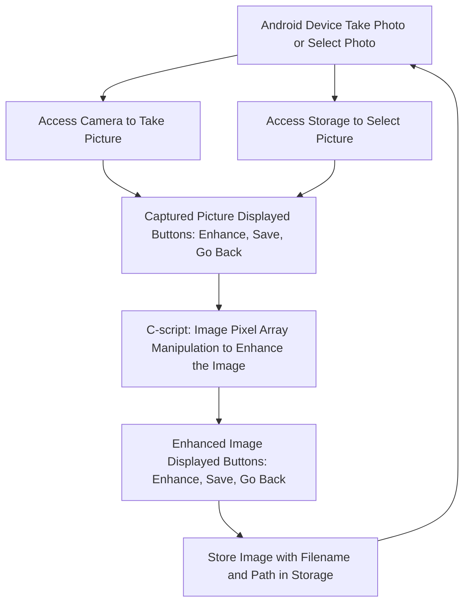

# 📱 Document Scanner App
---

## 📖 Abstract

**Document Scanner App** is an Android application designed to enhance the readability of text within images. By applying image processing techniques like grayscale conversion and thresholding, the app makes text darker and more visible while lightening the background, improving the overall clarity of documents. This app helps users digitize documents in a clearer and more legible format with just a single tap.

---

## 🧠 Keywords

`Android` `Application` `Image Processing` `Text Enhancement` `JNI` `Grayscale` `Thresholding`

---

## 🎯 Objectives

* To develop a mobile app that processes images of documents.
* To improve the legibility of text within captured or selected images using grayscale and thresholding techniques.
* To provide an accessible solution on Android devices for reading scanned documents.

---

## 🔍 Literature Survey

### A. CamScanner

Developed by INTSIG (China), CamScanner offers advanced image enhancement, auto-cropping, multi-image merging, and PDF generation.

### B. Microsoft Lens

Microsoft Lens enhances images, uses OCR for digitizing printed/handwritten text, and exports to multiple formats like PDF, Word, Excel. It supports saving to OneNote, OneDrive, and more.

---

## 🛠️ Methodology

### A. Application Layout

* **Buttons:**

  * `Select Image`: Choose an image from storage
  * `Take Photo`: Capture an image using the camera
  * `B/W`: Apply enhancement
  * `Save Image`: Save processed image to storage
  * `Go Back`: Return to the main screen
* OnClick listeners handle actions and permissions.
* Selected or captured image is resized to fit screen.

### B. Application Linking

* Required Permissions: `Camera`, `Storage`
* Uses **Java Native Interface (JNI)** to call C-based image processing functions from Java.
* Bitmap of the image is converted to a 1D array and passed to native code.

### C. Image Processing

* **Greyscaling**: Converts each pixel using average of R, G, B values.
* **Thresholding**:

  ```text
  If pixel_value > threshold → 255 (white)
  Else → 0 (black)
  ```
* This results in high contrast between text and background.

---

## 📱 Screenshots

<div align="center">
  
  
  
</div>


---

## 🧾 References

1. [CamScanner - INTSIG Information Co.](https://www.camscanner.com/)
2. [Microsoft Lens](https://support.microsoft.com/en-us/topic/microsoft-lens-for-android-d88f3d43-bf64-4b7e-a43b-31e4a25f2944)
3. Android Documentation - [https://developer.android.com](https://developer.android.com)
4. OpenCV Thresholding Guide - [https://docs.opencv.org](https://docs.opencv.org)

---

## 🔁 Flow Chart



---

## 🚀 How to Run

1. Clone this repository.
2. Open it in Android Studio.
3. Connect an Android device or use an emulator.
4. Run the app.

Make sure the following permissions are enabled on the device:

* Camera Access
* Storage Access

---

Let me know if you'd like help adding diagrams (like the image processing pipeline), building the image processing C code, or integrating OCR for future improvements!
